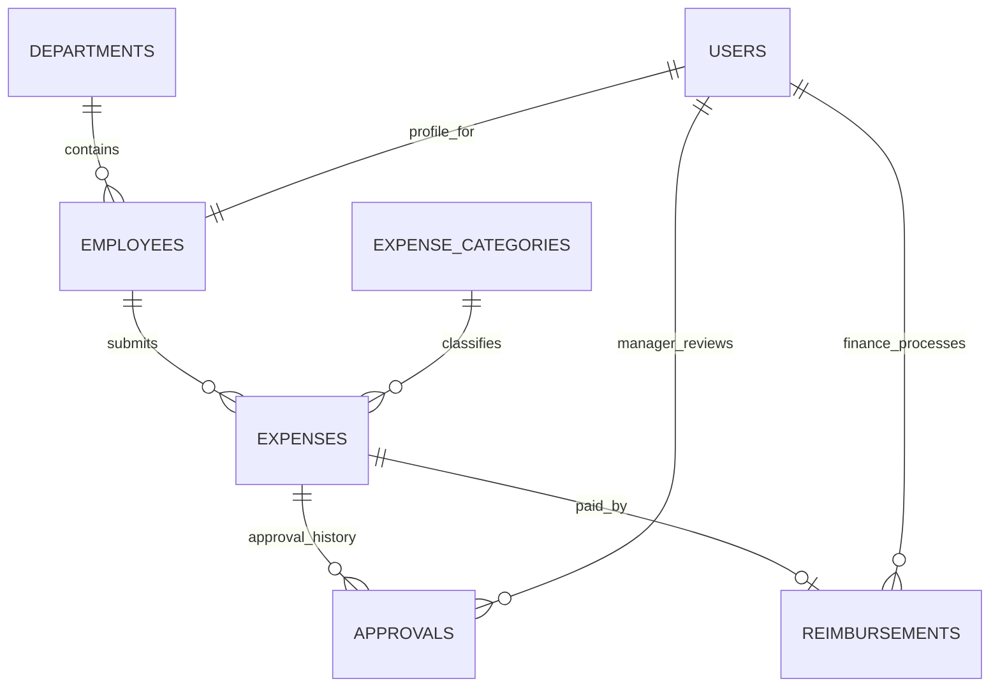

# Corporate Expense and Reimbursement Database Report

## 1. Project and database overview

This database supports an organization's employee expense and reimbursement workflow. It stores login accounts, employee profile and department data, expense submissions and receipt references, manager approval decisions, and finance reimbursement records.

| Property | Value |
| --- | --- |
| Database name | `corporate_expense_db` |
| Database engine | MySQL / InnoDB |
| Character set | `utf8mb4` |
| Application connection | `db.py` reads `MYSQL_HOST`, `MYSQL_USER`, and `MYSQL_PASSWORD` from the environment |
| Fresh-install SQL | `database/corporate_expense_db.sql` |

The SQL script creates the database and seven tables, primary and foreign keys, indexes, and starter departments and expense categories. It uses `IF NOT EXISTS` and does not drop existing objects. It is intended for a new installation; an existing database may need the migration scripts documented in the README.

## 2. Entity relationship diagram



## 3. Table and column data dictionary

### `users` — credentials and roles

| Column | Type | Rules | Description |
| --- | --- | --- | --- |
| `user_id` | `INT UNSIGNED` | Primary key, auto increment | Internal account identifier |
| `username` | `VARCHAR(50)` | Required, unique | Login name |
| `password_hash` | `VARCHAR(255)` | Required | Werkzeug password hash; never store plaintext passwords |
| `role` | `VARCHAR(32)` | Required, defaults to `Employee` | `Employee`, `Manager`, `Finance`, or `Admin` |
| `created_at` | `TIMESTAMP` | Defaults to current time | Account creation time |

The login page has Employee, Manager, and Finance/Admin role choices. The latter is one UI choice that accepts accounts whose stored role is either `Finance` or `Admin`; the database stores the role names separately.

### `departments` — organization departments

| Column | Type | Rules | Description |
| --- | --- | --- | --- |
| `department_id` | `INT UNSIGNED` | Primary key, auto increment | Internal department identifier |
| `department_name` | `VARCHAR(100)` | Required, unique | Department label shown during signup and reporting |
| `created_at` | `TIMESTAMP` | Defaults to current time | Row creation time |

The setup script seeds Engineering, Finance, Human Resources, Marketing, and Operations. Add or rename departments to match the organization.

### `employees` — employee profile

| Column | Type | Rules | Description |
| --- | --- | --- | --- |
| `employee_id` | `INT UNSIGNED` | Primary key, auto increment | Internal employee identifier used by expense rows |
| `user_id` | `INT UNSIGNED` | Required, unique, FK to `users.user_id` | Login account for this employee |
| `department_id` | `INT UNSIGNED` | Required, FK to `departments.department_id` | Department membership; used to scope manager review |
| `first_name` | `VARCHAR(80)` | Required | Given name |
| `last_name` | `VARCHAR(80)` | Required | Family name |
| `email` | `VARCHAR(254)` | Optional | Contact email |
| `mobile_no` | `VARCHAR(20)` | Required | Mobile number collected at signup |
| `gender` | `VARCHAR(30)` | Required | Gender option collected at signup |
| `created_at` | `TIMESTAMP` | Defaults to current time | Profile creation time |

Each account created through public signup receives an employee profile and starts with the `Employee` role. A manager is also an employee so they can submit and track personal expenses while reviewing their department's claims.

### `expense_categories` — expense form choices

| Column | Type | Rules | Description |
| --- | --- | --- | --- |
| `category_id` | `INT UNSIGNED` | Primary key, auto increment | Internal category identifier |
| `category_name` | `VARCHAR(100)` | Required, unique | Expense category label |
| `description` | `VARCHAR(255)` | Optional | Category guidance |

The starter data includes Travel, Meals, Accommodation, Transportation, Office Supplies, Communication, Training, and Other.

### `expenses` — employee claims

| Column | Type | Rules | Description |
| --- | --- | --- | --- |
| `expense_id` | `INT UNSIGNED` | Primary key, auto increment | Claim identifier |
| `employee_id` | `INT UNSIGNED` | Required, FK to `employees.employee_id` | Claim owner |
| `category_id` | `INT UNSIGNED` | Required, FK to `expense_categories.category_id` | Claim category |
| `expense_date` | `DATE` | Required | Date the expense occurred |
| `description` | `VARCHAR(500)` | Required | Claim details |
| `amount` | `DECIMAL(12,2)` | Required | Claimed amount with two decimal places |
| `payment_method` | `VARCHAR(30)` | Required | Cash, debit card, credit card, UPI, or bank transfer |
| `status` | `VARCHAR(20)` | Required, defaults to `Pending` | Workflow state: `Pending`, `Approved`, `Rejected`, or `Reimbursed` |
| `receipt_reference` | `VARCHAR(255)` | Optional | Receipt number or manually entered receipt details |
| `receipt_file` | `VARCHAR(255)` | Optional | Random stored filename for an uploaded receipt; file bytes are kept under the Flask instance folder |
| `created_at` | `TIMESTAMP` | Defaults to current time | Row creation time |
| `updated_at` | `TIMESTAMP` | Defaults to current time; updates automatically | Last row update time |

Indexes support employee/date, category, and status/date queries. The application accepts PDF, PNG, and JPEG receipt uploads up to 5 MB.

### `approvals` — manager decision history

| Column | Type | Rules | Description |
| --- | --- | --- | --- |
| `approval_id` | `INT UNSIGNED` | Primary key, auto increment | Approval event identifier |
| `expense_id` | `INT UNSIGNED` | Required, FK to `expenses.expense_id` | Reviewed claim |
| `manager_id` | `INT UNSIGNED` | Required, FK to `users.user_id` | Manager account that made the decision |
| `decision` | `VARCHAR(20)` | Required | `Approved` or `Rejected` |
| `remarks` | `VARCHAR(500)` | Optional | Manager's note to the employee |
| `approval_date` | `TIMESTAMP` | Defaults to current time | Decision time |

Multiple rows per expense are allowed so the table can retain an approval history. The current claim state is stored in `expenses.status`.

### `reimbursements` — finance payment records

| Column | Type | Rules | Description |
| --- | --- | --- | --- |
| `reimbursement_id` | `INT UNSIGNED` | Primary key, auto increment | Payment record identifier |
| `expense_id` | `INT UNSIGNED` | Required, unique, FK to `expenses.expense_id` | Approved expense being reimbursed; unique to prevent duplicate payment rows |
| `processed_by` | `INT UNSIGNED` | Required, FK to `users.user_id` | Finance/Admin account processing the payment |
| `amount` | `DECIMAL(12,2)` | Required | Reimbursed amount |
| `reimbursement_date` | `TIMESTAMP` | Defaults to current time | Processing time |
| `status` | `VARCHAR(30)` | Required, defaults to `Processed` | Reimbursement processing state |

## 4. Relationships, keys, and data integrity

- One user account has one employee profile. `employees.user_id` is unique and references `users.user_id`.
- Each employee belongs to one department; a department can have many employees.
- Each expense belongs to one employee and one category. Employees and categories can each have many expenses.
- One expense can have multiple approval records and at most one reimbursement record.
- Approval and reimbursement records retain the related user account through `manager_id` and `processed_by`.
- Foreign keys use `ON UPDATE CASCADE` and `ON DELETE RESTRICT`. This protects audit history from accidental deletion of referenced records.
- Monetary values use `DECIMAL(12,2)` instead of floating-point types.
- InnoDB supports the foreign keys and transaction behavior used by signup, approval, and reimbursement operations.

## 5. Role capabilities represented by the application

| Role | Application access |
| --- | --- |
| Employee | Personal profile, expense submission and receipts, own expense list, reimbursement status/history, and personal analytics |
| Manager | Employee capabilities plus department expense review, approve/reject decisions, remarks, and department analytics |
| Finance | Organization-wide expense view, approved-claim verification, reimbursement processing, financial analytics, pending reimbursement monitoring, and CSV report |
| Admin | Uses the Finance/Admin dashboard and finance capabilities |

The role is checked by the Flask application and is not selected during public signup. Accounts for managers and Finance/Admin should be provisioned by a trusted administrator after signup.

## 6. Creating the database

### New installation using MySQL Workbench

1. Open `database/corporate_expense_db.sql` in MySQL Workbench.
2. Connect to the MySQL server and run the complete script.
3. Refresh the Schemas panel and confirm `corporate_expense_db` contains the seven tables listed above.
4. Configure `MYSQL_HOST`, `MYSQL_USER`, `MYSQL_PASSWORD`, and `FLASK_SECRET_KEY` in the shell where Flask will run. See `README.md` for PowerShell examples.
5. Install the Python requirements and start the application with `python app.py`.
6. Register an employee through the signup page. Signup inserts a user and employee profile in one transaction.
7. Register the people who will act as managers or Finance/Admin users, then assign their elevated roles using the SQL below.

### Provisioning manager and Finance/Admin roles

Run the matching statement after the account has been registered. Substitute the person's exact unique username.

```sql
UPDATE users SET role = 'Manager' WHERE username = 'manager_username';
UPDATE users SET role = 'Finance' WHERE username = 'finance_username';
UPDATE users SET role = 'Admin' WHERE username = 'admin_username';
```

Managers must have an employee profile with the department they manage. Finance/Admin accounts are linked to employee profiles by the standard signup flow, though finance access itself is organization-wide.

### Existing installation

Do not rerun a fresh schema script as a substitute for reviewing an existing database. Check the current schema first. The project includes `database/signup_profile_columns.sql` for missing profile fields and `database/expense_receipt_reference.sql` for receipt fields. The README describes when to use them.

## 7. Seed data and account security

The SQL setup seeds only department and expense-category reference data. It deliberately creates no sample users or known passwords. Password hashes are generated by the Flask signup route using Werkzeug. Database credentials and the Flask session key are configured outside the source files through environment variables.
